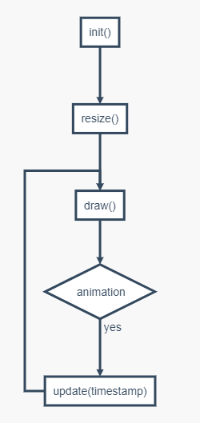

# Janvas

A lightweight&amp;simple 2D javascript library based on HTML5 Canvas.

一款轻量、简单的基于 HTML5 Canvas 2d 绘图上下文的 JavaScript 绘图库，不仅便于 *拓展*，拥有极佳的 *灵活度* 和超越原生 canvas API 开发的 *性能*，更是 *渐进迭代式* 开发的绝佳选择。

总之，**janvas** 库只做了它该做的基础建设，在此基础上&darr;

## Janvas 能做

1. 高度定制化图表
2. 可视化大屏
3. 特效
4. 物理模拟
5. 数学可视化
6. 游戏
7. 图像处理
8. \.\.\.

## Janvas 的特点

1. 简单，要什么就 new 出来；
2. 高效，比原生 API 开发更直观、渲染效率也更高；
3. 易用，图形变形 shape.getMatrix().set...()，样式 shape.getStyle().set...()；
4. 强大，原生封装绘制、SVG Path 支持、坐标点等等计算的支持；
5. 兼容，只需一个具有宽高的容器 div，不管它在哪里 **janvas** 都能精准地填充它并适配高分屏。

## 安装

1. `<script src="https://cdn.jsdelivr.net/npm/janvas"></script>`
2. `npm install janvas --save`

## [Hello World](https://jarenchow.github.io/JanvasExamples/html/hello_world.html)

- 与既有 Canvas 项目整合（功能受限）
  1. `<canvas></canvas>`
  2. `<script src="https://cdn.jsdelivr.net/npm/janvas"></script>`
  3. `var ctx = document.querySelector("canvas").getContext("2d");`
  4. `var text = new janvas.Text(ctx, 50, 50, "HelloWorld"); // new 一个文本`
  5. `text.fill(); // 文本绘制`

- 使用 janvas.Canvas 开发（全部功能）

```html
<body>

<div id="app" style="width: 100%;height: 100%;"></div>

<script src="https://cdn.jsdelivr.net/npm/janvas"></script>
<script>
  // 在 div 容器 中央绘制 "HelloWorld"
  var helloWorld = new janvas.Canvas({
    container: "#app", // 找到容器 id
    methods: {
      init: function () { // 初始化，此回调仅会调用一次
        this.text = new janvas.Text(this.$ctx, 0, 0, "HelloWorld"); // new 一个 Text
        this.text.getStyle().setFont("small-caps bold 128px courier")
          .setTextAlign("center").setTextBaseline("middle"); // 给 Text 设置样式
      },
      resize: function () { // 在每次 <canvas> 大小发生改变时回调
        this.text.setStart(this.$width / 2, this.$height / 2); // 置于中间
      },
      draw: function () { // 在此回调时
        this.text.fill(); // 让 Text 进行绘制
      }
    }
  });
</script>

</body>
```

## Janvas 示例

详见 [JanvasExamples](https://github.com/JarenChow/JanvasExamples)

## 源代码

从一开始 **janvas** 本只想以最简洁的方式应用到项目中，所以没有以 npm 方式管理包，之后有需求与精力再重写。

目前 [janvas.min.js](./dist/janvas.min.js) 仅使用 [uglifyjs](https://github.com/mishoo/UglifyJS) --compress 简单压缩无混淆。

## 总览

[overview.md](./doc/overview.md)

## 文档（待写）

### janvas.Canvas

#### 生命周期

1. 创建：`var obj = new janvas.Canvas(options);`
2. 周期：
3. 销毁：`obj.$destroy();`，框架将：
   - 移除所有事件监听器
   - 删除所有事件监听器
   - 停止动画并移除引用
   - 移除 `<canvas>` 元素
   - `resize/intersection unobserve`
   - `obj.ownProperties = void (0)`

## License

[MIT](https://opensource.org/licenses/MIT)
